# People Analytics — Análise de Rotatividade de Colaboradores


[](#dashboard-power-bi)

Análise ponta a ponta da rotatividade de 1.200 colaboradores: tratamento dos dados, análise exploratória com testes estatísticos, evolução do turnover ao longo do tempo e um modelo de regressão logística para identificar o que realmente explica as saídas voluntárias.

## Resumo em 30 segundos

- **O turnover anual mais que dobrou:** foi de 5,2% em 2022 para 9,6% em 2025 e caminha para **14,0% em 2026** (anualizado). Cerca de 3 em cada 4 saídas são voluntárias.
- **O primeiro ano é o período crítico:** **46,9%** dos colaboradores com até 1 ano de casa foram desligados, contra 13,6% entre os que têm mais de 10 anos.
- **Só três fatores se sustentam no modelo:** tempo de empresa, satisfação no trabalho e equilíbrio entre vida e trabalho. Cada nível a mais de satisfação reduz a chance de saída em cerca de 15%.
- **Nem toda diferença é real:** área, salário e horas extras mostram diferenças nos gráficos, mas **não são estatisticamente significativas**. O efeito da promoção **desaparece** quando se controla o tempo de empresa.

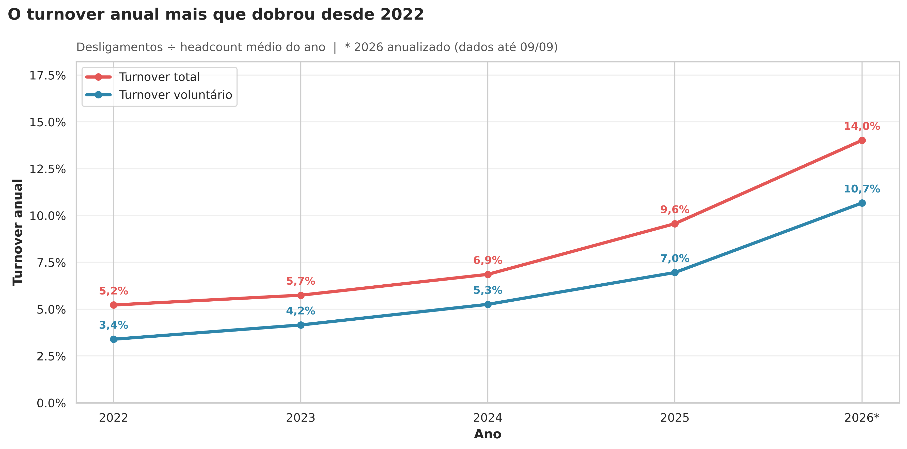

**Recomendação principal:** concentrar as ações de retenção no primeiro ano do colaborador (onboarding, acompanhamento de 30/60/90 dias e conversas de permanência) e monitorar mensalmente satisfação e equilíbrio entre vida e trabalho.

---

## Problema de Negócio

A rotatividade gera custos com recrutamento, seleção, treinamento e perda de conhecimento. O projeto responde:

1. Qual é o nível de rotatividade e como ele evolui ao longo do tempo?
2. Em qual momento da jornada do colaborador o risco de saída é maior?
3. Quais fatores estão associados às saídas e quais diferenças podem ser apenas variação aleatória?
4. Quando todos os fatores são avaliados em conjunto, quais continuam relevantes?
5. Onde a área de RH deve concentrar as ações de retenção?

## Principais Resultados

### 1. O turnover está acelerando

| Ano | Headcount médio | Desligamentos | Turnover anual | Turnover voluntário |
| --- | ---: | ---: | ---: | ---: |
| 2022 | 766 | 40 | 5,2% | 3,4% |
| 2023 | 818 | 47 | 5,7% | 4,2% |
| 2024 | 873 | 60 | 6,9% | 5,3% |
| 2025 | 920 | 88 | 9,6% | 7,0% |
| 2026* | 910 | 88 | 14,0% | 10,7% |

\* Dados até 09/09/2026, valores anualizados. Turnover = desligamentos ÷ headcount médio do ano.

Em 2026 também houve forte redução de contratações (22 admissões até setembro, contra 135 em 2025), e o headcount caiu 6,9% no ano.

### 2. Quase metade dos colaboradores sai no primeiro ano

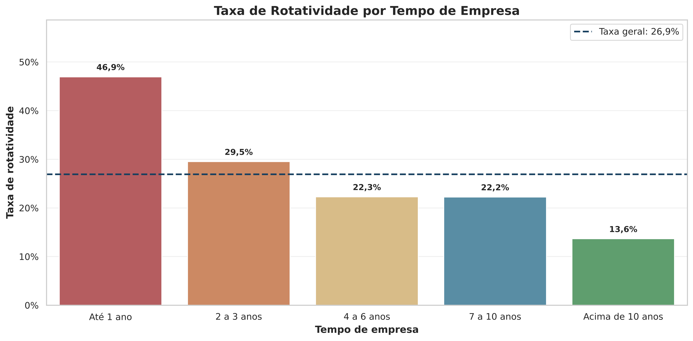

### 3. O que é significativo e o que não é

Cada recorte foi avaliado com o **teste qui-quadrado de independência** (nível de significância de 5%):

| Fator | Resultado | p-valor | Significativo? |
| --- | --- | ---: | :---: |
| Tempo de empresa | 46,9% no 1º ano vs. 13,6% acima de 10 anos | < 0,001 | Sim |
| Satisfação no trabalho | 32,9%–34,2% nos níveis 1–2 vs. 21,6% no nível 5 | 0,002 | Sim |
| Equilíbrio vida-trabalho | 33,5% no nível 1 vs. 21,6% no nível 4 | 0,031 | Sim |
| Promoção nos últimos 5 anos | 28,5% sem promoção vs. 22,1% com promoção | 0,035 | Sim* |
| Horas extras | 29,2% com vs. 25,6% sem | 0,20 | Não |
| Área | 33,5% em Atendimento vs. 20,9% em Tecnologia | 0,27 | Não |
| Faixa salarial | 30,0% no 1º quartil vs. 23,7% no 4º quartil | 0,38 | Não |

\* Deixa de ser significativo no modelo multivariado (ver abaixo).

### 4. O que explica a saída voluntária (regressão logística)

Avaliando todos os fatores ao mesmo tempo, apenas três continuam associados à saída voluntária:

| Fator | Odds ratio | Leitura |
| --- | ---: | --- |
| Tempo de empresa (+1 ano) | 0,86 | Reduz a chance de saída em ~14% |
| Satisfação no trabalho (+1 nível) | 0,85 | Reduz a chance de saída em ~15% |
| Equilíbrio vida-trabalho (+1 nível) | 0,87 | Reduz a chance de saída em ~13% |

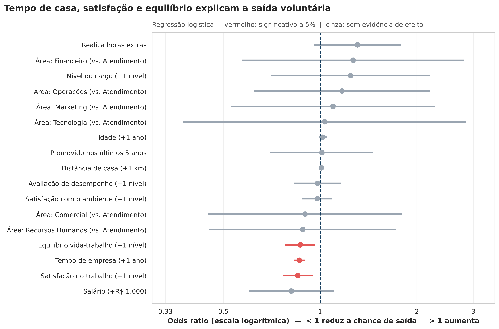

A promoção, que parecia relevante na análise isolada, **não tem efeito** quando o tempo de empresa é controlado (odds ratio = 1,01; p = 0,94): quem está há mais tempo na empresa foi mais promovido e também sai menos.

O modelo obteve **AUC de 0,68** em uma base de teste separada (30%). Ele é útil para **explicar** quais alavancas importam, mas não é preciso o suficiente para prever saídas individuais, e não deve ser usado para isso.

### 5. Motivos de desligamento

Os motivos estão distribuídos de forma equilibrada. Cerca de 27% das saídas foram por iniciativa da empresa (desempenho e reestruturação) e 73% por iniciativa do colaborador, com destaque para nova oportunidade profissional, qualidade de vida e falta de perspectiva de crescimento.

<details>
<summary><b>Ver todos os gráficos da análise exploratória</b></summary>

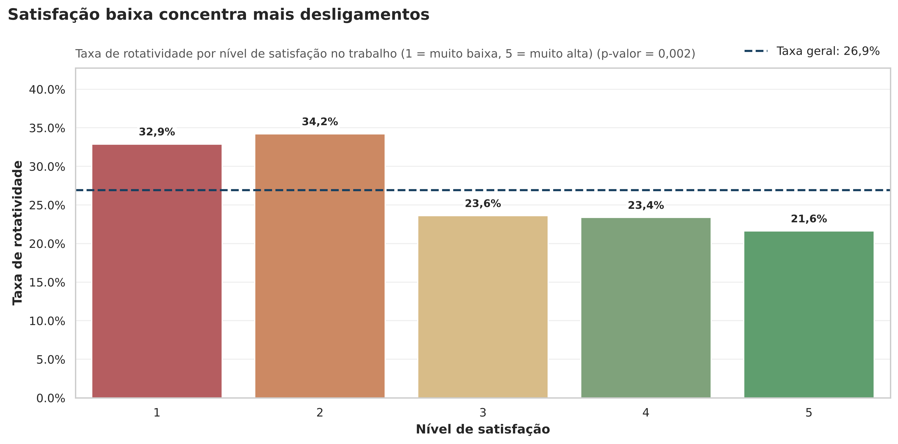
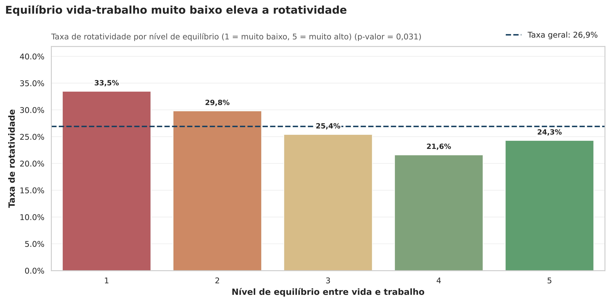
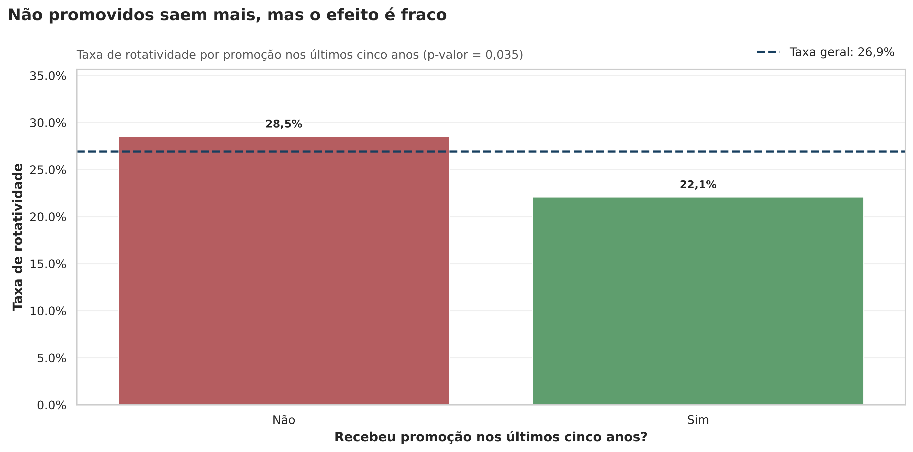
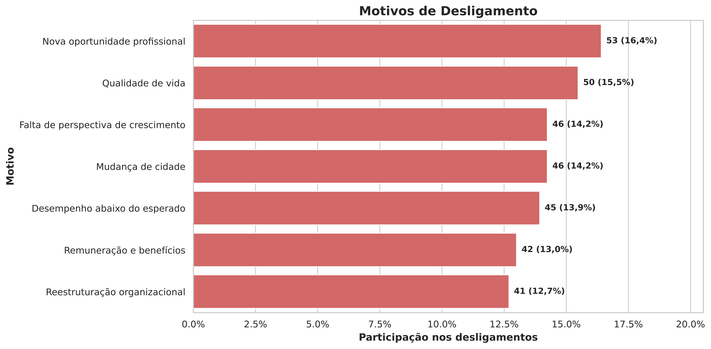
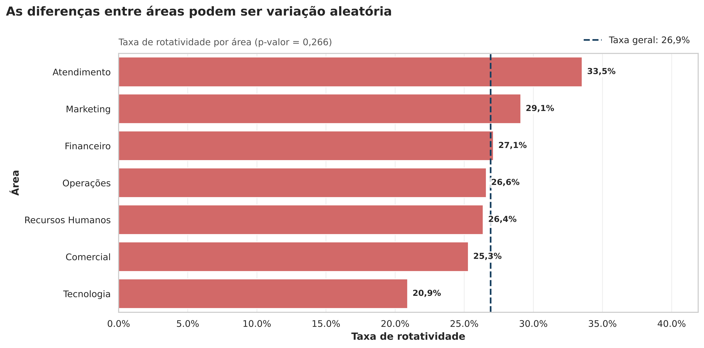
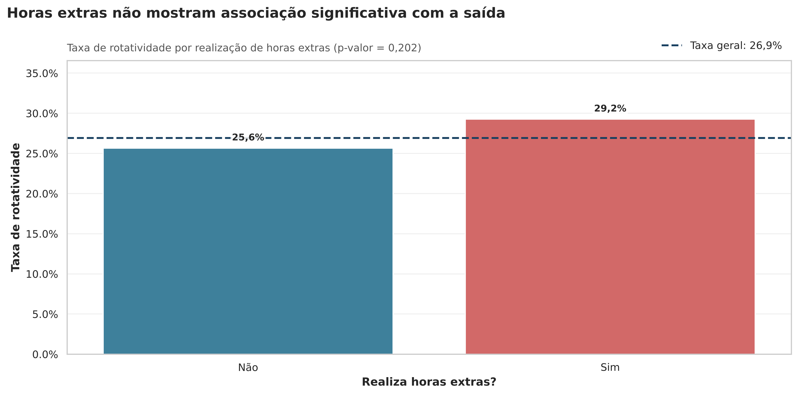
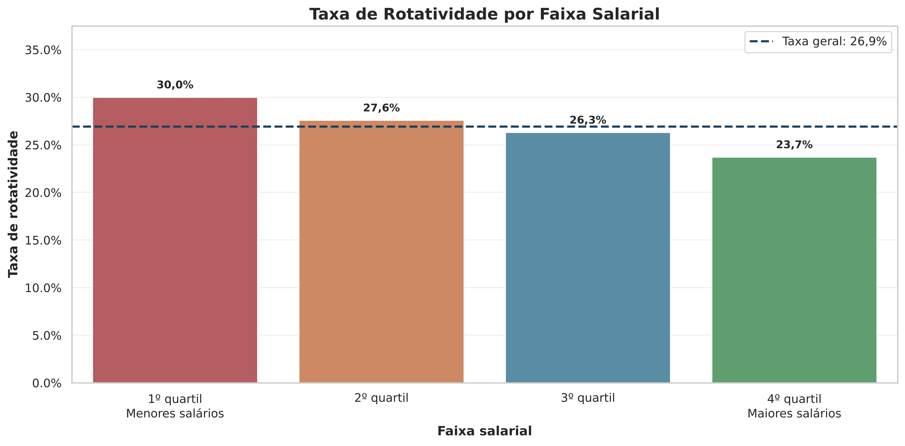
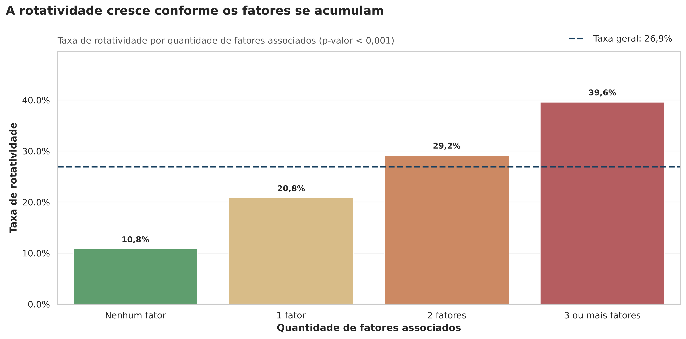
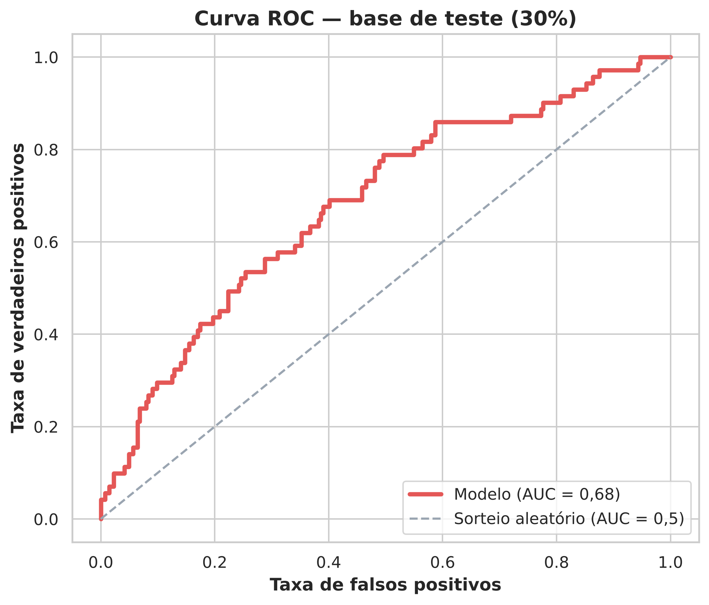

</details>

## Dashboard Power BI

Dashboard interativo com 4 páginas, construído a partir das bases geradas pelos notebooks. Arquivo: [`powerBi/People Analytics Dashboard.pbix`](powerBi/People%20Analytics%20Dashboard.pbix).

### 1. Visão Geral: como está o turnover?
Indicadores principais, evolução anual do turnover (total e voluntário), admissões × desligamentos e motivos de saída.

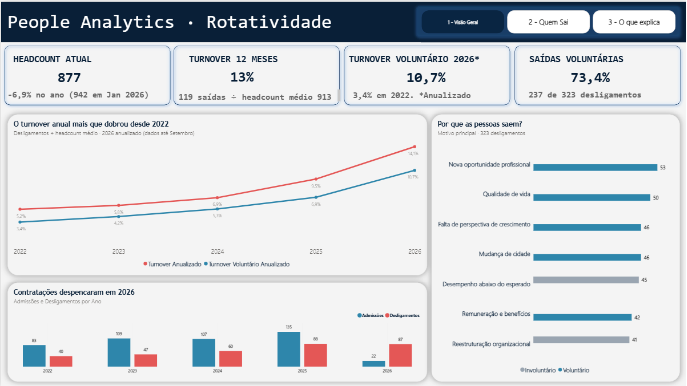

### 2. Quem Sai: onde está o risco?
Taxa de rotatividade por tempo de empresa, satisfação e equilíbrio vida-trabalho, com destaque automático para os grupos acima da taxa geral e filtros por área, nível, horas extras, faixa salarial e tipo de desligamento.

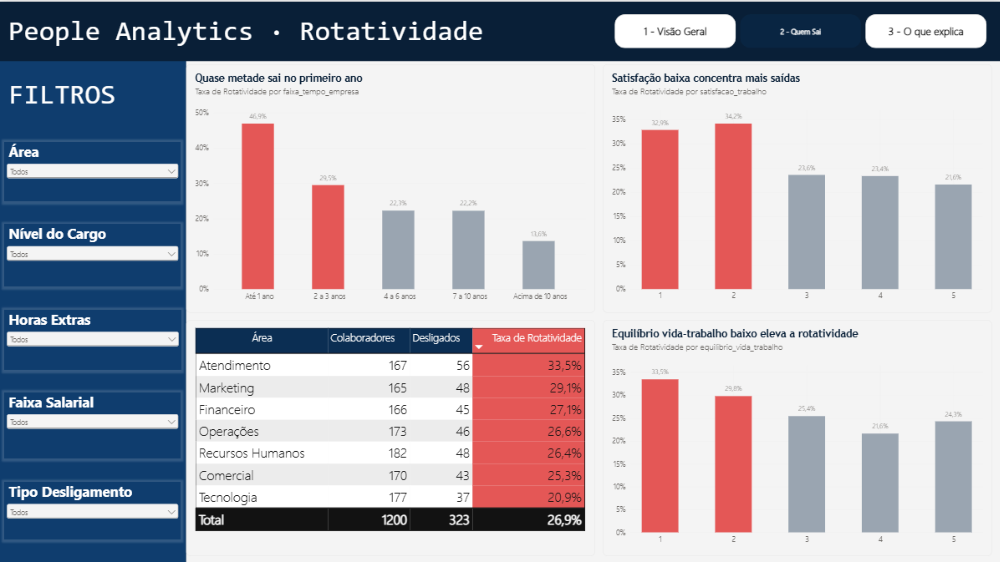

### 3. O que explica: o que realmente importa?
Resultado da regressão logística: efeito de cada fator na chance de saída voluntária, com os fatores significativos destacados.

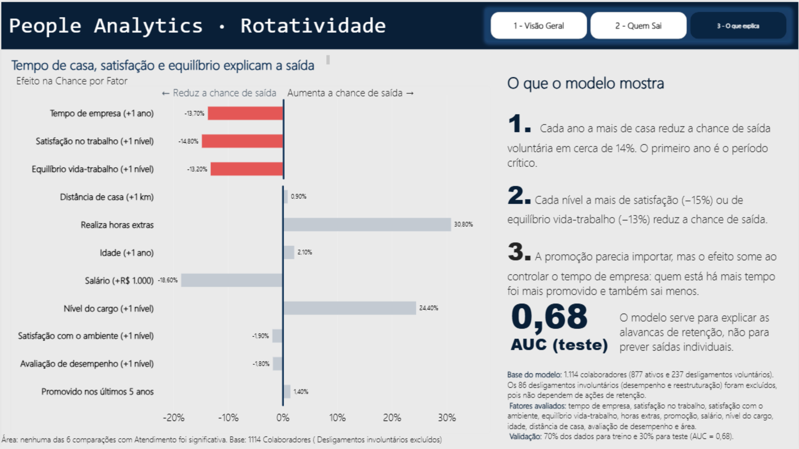

### 4. Como ler
Página de apoio para quem não é da área de dados: definição dos indicadores, o que significa "estatisticamente significativo", como interpretar a AUC e orientações de uso responsável.

**Técnicas utilizadas:** modelo estrela com tabela calendário, medidas DAX (turnover anualizado, turnover 12 meses com `DATESINPERIOD`, taxa geral com `REMOVEFILTERS`), formatação condicional por medida e navegação entre páginas.

## Recomendações

| Prioridade | Evidência | Ação recomendada | Indicador de acompanhamento |
| :---: | --- | --- | --- |
| 1 | Turnover anual subiu de 5,2% para 14,0% | Definir meta anual de turnover e acompanhar mensalmente | Turnover 12 meses (total e voluntário) |
| 2 | 46,9% de saída no primeiro ano | Onboarding com metas de 30/60/90 dias e conversas de permanência aos 3, 6 e 12 meses | Turnover em até 12 meses de casa |
| 3 | Satisfação: −15% de chance de saída por nível | Pesquisas rápidas de clima e desenvolvimento de lideranças | Satisfação média por equipe |
| 4 | Equilíbrio: −13% de chance de saída por nível | Revisar carga de trabalho, escalas e flexibilidade | Índice de equilíbrio vida-trabalho |
| 5 | Área, salário e horas extras sem significância | Não priorizar ações com base nesses recortes; coletar dados mais detalhados | Horas extras em quantidade; salário vs. mercado |

## Metodologia

```text
data/raw  ──►  01_etl  ──►  data/processed  ──►  02_eda  ──►  03_modelo  ──►  Power BI
 (Excel)      limpeza e       base tratada       testes e      regressão       dashboard
              validação       e analítica        evolução      logística
```

| Etapa | Notebook | Principais técnicas |
| --- | --- | --- |
| Preparação | [`01_etl.ipynb`](notebooks/01_etl.ipynb) | Remoção de 12 duplicidades, tratamento de 43 ausentes (mediana por grupo), recálculo do tempo de empresa a partir das datas, 14 testes automatizados de qualidade |
| Análise exploratória | [`02_eda.ipynb`](notebooks/02_eda.ipynb) | Turnover anual e mensal (headcount médio), voluntário vs. involuntário, taxas por segmento, qui-quadrado e V de Cramér |
| Modelo | [`03_modelo_rotatividade.ipynb`](notebooks/03_modelo_rotatividade.ipynb) | Regressão logística (statsmodels), odds ratio com IC 95%, validação treino/teste e AUC |
| Dashboard | [`powerBi/`](powerBi/) | Power BI com 4 páginas: modelo estrela, medidas DAX, formatação condicional e navegação |

As funções reutilizáveis (cálculo de taxas, teste estatístico e padrão dos gráficos) ficam em [`src/people_analytics.py`](src/people_analytics.py), evitando repetição de código nos notebooks.

## Estrutura do Projeto

```text
people-analytics-turnover
├── data
│   ├── raw
│   │   └── People_Analytics_Analise_de_Rotatividade_de_Colaboradores.xlsx
│   └── processed
│       ├── People_Analytics_Base_Tratada.csv / .xlsx
│       ├── People_Analytics_Base_Analitica.csv
│       ├── People_Analytics_Rotatividade_Anual.csv
│       ├── People_Analytics_Rotatividade_Mensal.csv
│       ├── People_Analytics_Modelo_Odds_Ratio.csv
│       └── People_Analytics_Resumo_KPIs.csv
├── imagens
├── notebooks
│   ├── 01_etl.ipynb
│   ├── 02_eda.ipynb
│   └── 03_modelo_rotatividade.ipynb
├── powerBi
│   ├── People Analytics Dashboard.pbix
│   ├── Tema.json
│   ├── GUIA_DASHBOARD.md
│   └── People_Analytics_Resumo_Executivo.xlsx
├── src
│   └── people_analytics.py
├── README.md
└── requirements.txt
```

## Base de Dados

Base **sintética**, criada para fins educacionais e de portfólio. Não contém dados pessoais reais.

- 1.212 registros brutos e 23 variáveis (dados demográficos, cargo, salário, satisfação, desempenho, promoção, data e motivo de desligamento);
- 12 duplicidades e 43 valores ausentes intencionais;
- Após o tratamento: 1.200 colaboradores únicos, 323 desligamentos (237 voluntários e 86 involuntários).

## Como Executar

```bash
git clone https://github.com/leandroanalytics/people-analytics-turnover.git
cd people-analytics-turnover

python -m venv .venv
# Windows
.venv\Scripts\activate
# Linux ou macOS
source .venv/bin/activate

pip install -r requirements.txt
```

Execute os notebooks na ordem: `01_etl` → `02_eda` → `03_modelo_rotatividade`.

## Limitações e Uso Responsável

- A base é sintética, e os resultados representam **associações**, não relações de causa e efeito.
- O tempo de empresa dos desligados é medido até a saída e o dos ativos até a data de referência. Uma análise de sobrevivência trataria essa diferença de forma mais adequada.
- O modelo e o indicador de fatores acumulados devem ser usados apenas em **análises agregadas**, nunca para classificar, punir ou tomar decisões sobre colaboradores individualmente.

## Próximos Passos

- Aplicar análise de sobrevivência (curva de Kaplan-Meier e modelo de Cox) ao tempo até o desligamento;
- Incorporar dados de horas extras em quantidade e de salário comparado ao mercado.

## Autor

**Leandro Gomes**
Profissional em transição para Dados e Business Intelligence, com experiência em gestão de negócios, indicadores, rentabilidade e apoio à tomada de decisão.

[GitHub — leandroanalytics](https://github.com/leandroanalytics)
